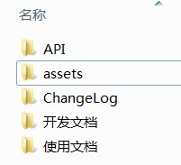

# 在Coding.net上建立文档项目

文档按照项目进行拆分，所以在[coding.net](http://coding.net)上新建项目时按照``doc_一级分类_项目名``作为项目名称

如 ``dpjia_new`` 的 文档项目为 ``DOC_BACK_dpjia_new`` 作为名称,FRONT是当前项目所属的一级分类，分类列表如下

<table>
	<thead>
		<tr>
			<th>名称</th>
			<th>分类名称</th>
		</tr>
	</thead>
	<tbody>
		<tr>
			<td>FRONT</td>
			<td>前端</td>
		</tr>
		<tr>
			<td>BACK</td>
			<td>后端</td>
		</tr>
		<tr>
			<td>ANDROID</td>
			<td>Android</td>
		</tr>
		<tr>
			<td>IOS</td>
			<td>iOS</td>
		</tr>
		<tr>
			<td>RENDER</td>
			<td>渲染器</td>
		</tr>
	</tbody>
</table>

# 文档项目的目录结构

``API``目录为使用如Doxygen工具生成的代码文档

``assets``目录为编写**使用文档**和**开发文档**需要引用的图片存放位置

``ChangeLog``目录为存放每周更新的更新日志文档，这个由文档项目自动生成，只需留目录即可

``开发文档``用于存放开发者需要知道的文档，如环境配置，入口，注意事项等

``使用文档``用于存放给对接人查看的文档，例如接口文档

# 文件命名规则

``API``目录下按照每个版本一个目录的方式将doxygen工具生成的目录整个拷进来提交

``ChangeLog``目录自动生成的文件也会按照``版本号生成文件名.md``文件存放在此处，例如``1.1.0.md``。所以每个项目在发布版本时，需要生成tag，并且推送到服务器

``开发文档``中的markdown**文件名**会作为侧边栏的**一级菜单**，文档内的**一级标题**会作为侧边栏的二级菜单

注：``API``,``assets``和``ChangeLog``是必须存在的目录，如果还有其他文档需求，可以自定义添加各类名称，文档的命名和上方``开发文档``的命名方式相同

